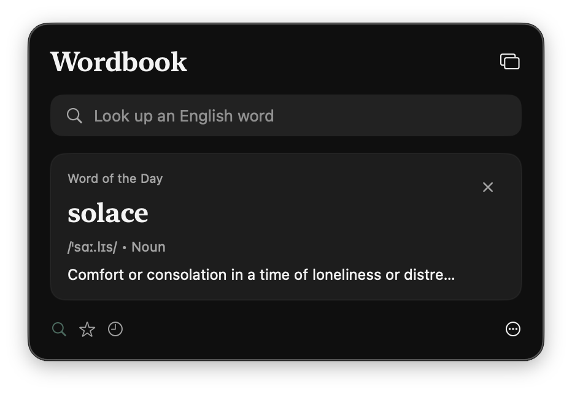
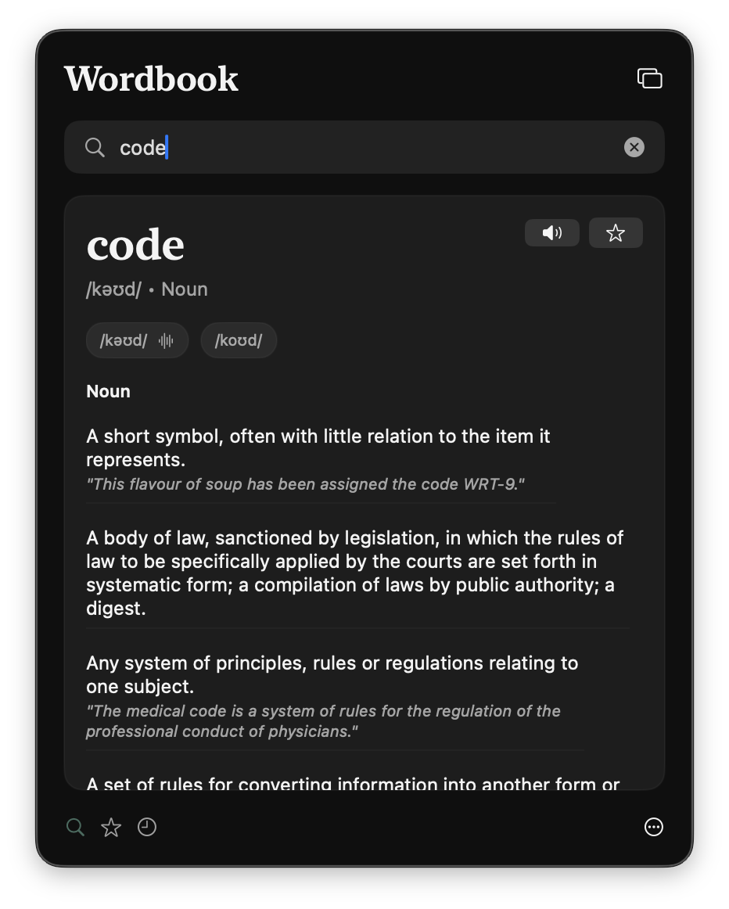
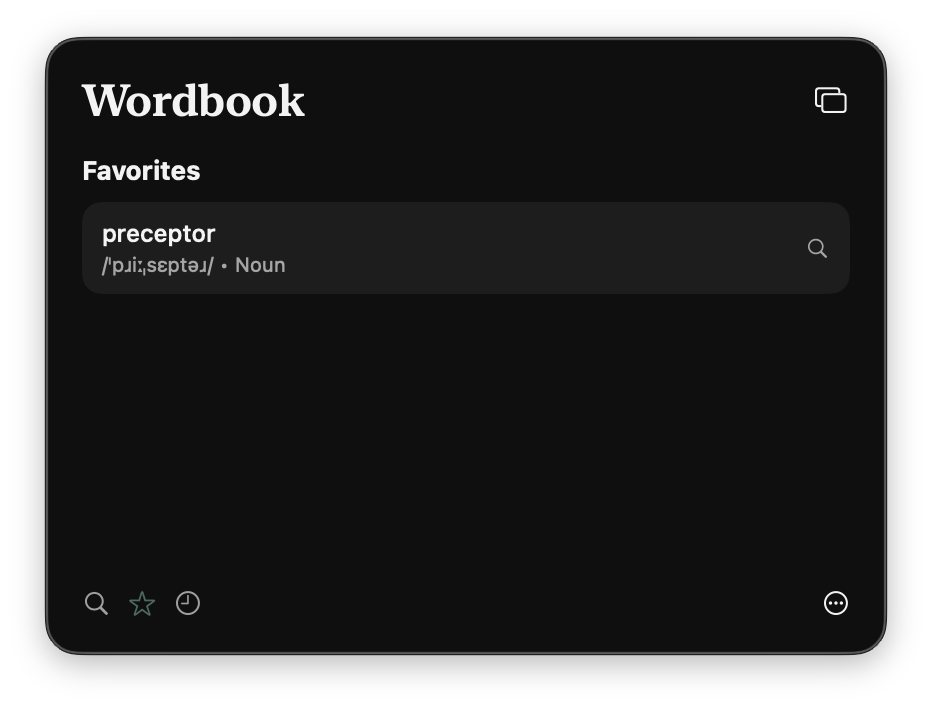
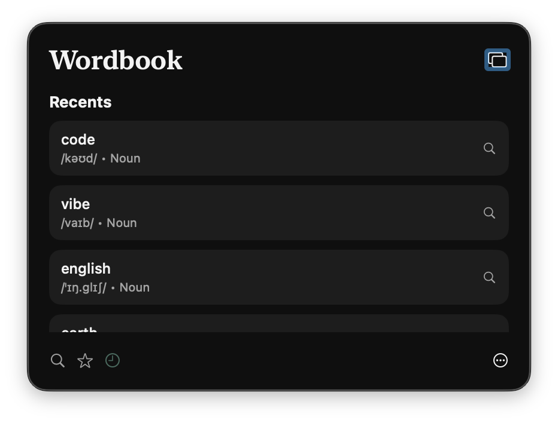
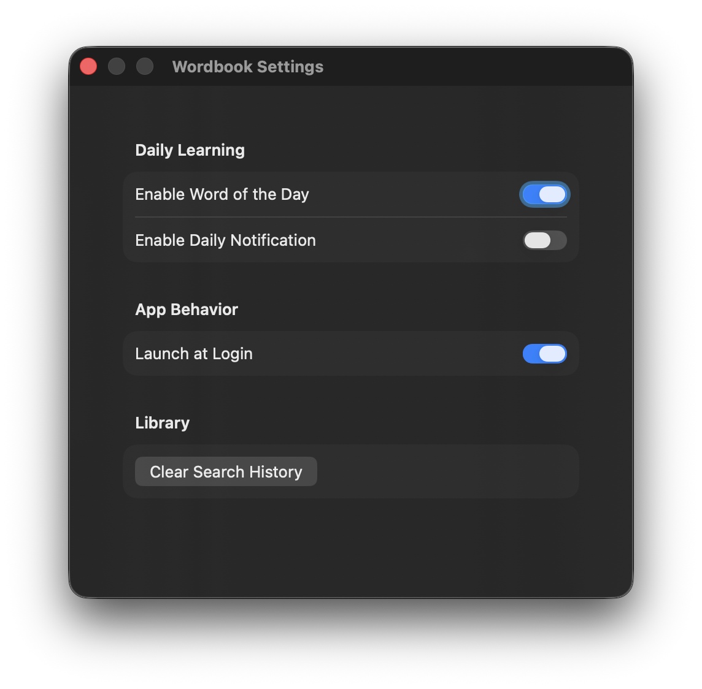
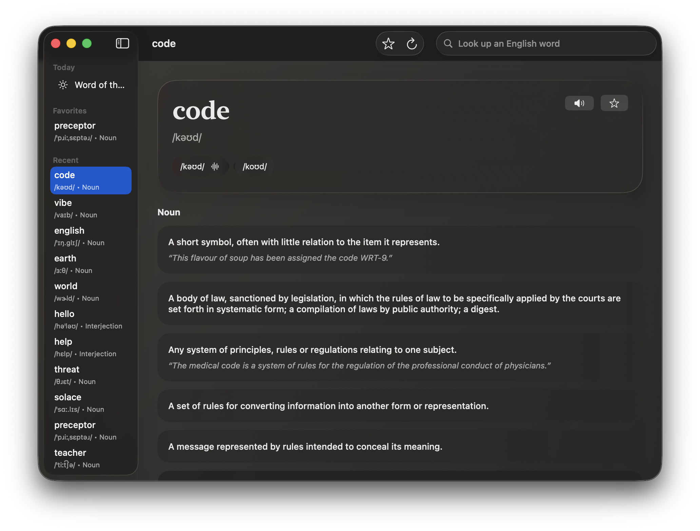

# Wordbook

Wordbook is a native macOS English dictionary app built with SwiftUI.

It is designed as a menu-bar-first utility, with a full dictionary window when you want more room to read. The app uses the free [Dictionary API](https://dictionaryapi.dev/) for English word lookups.

## Features

- Menu bar lookup with fast pronunciation playback
- Full word detail view with meanings, examples, synonyms, and antonyms
- Favorites and recents
- Word of the Day
- Native macOS settings and launch-at-login support

## Screenshots

### Menu Bar









### Windows





## Development

Run tests:

```bash
swift test
```

Build and launch the app bundle:

```bash
./script/build_and_run.sh
```

Verify launch:

```bash
./script/build_and_run.sh --verify
```

## Requirements

- macOS on Apple Silicon
- Xcode with Swift 6 toolchain support
